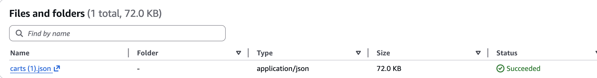
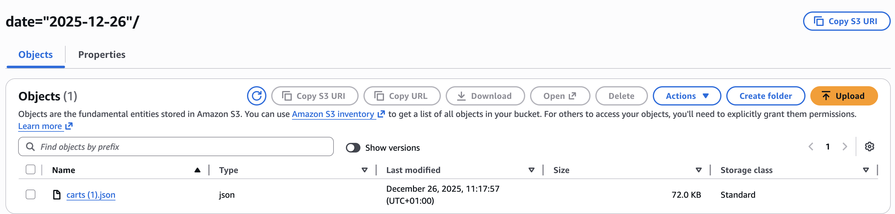
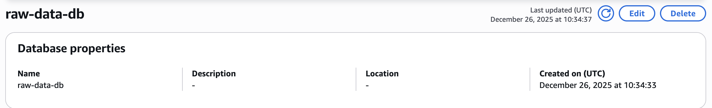
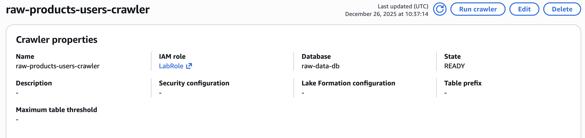
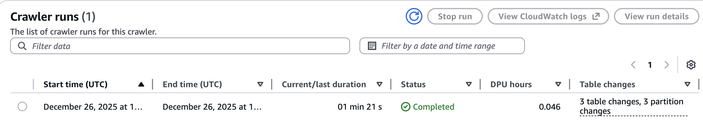
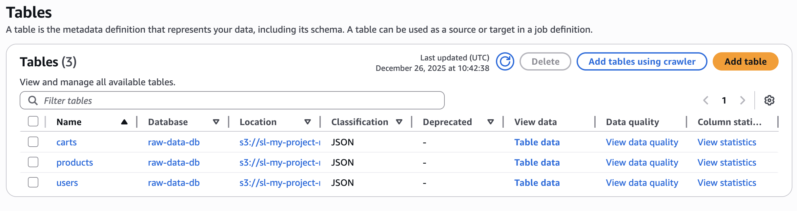
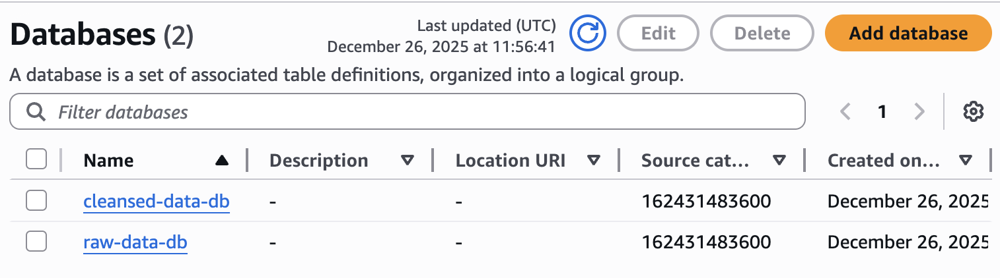
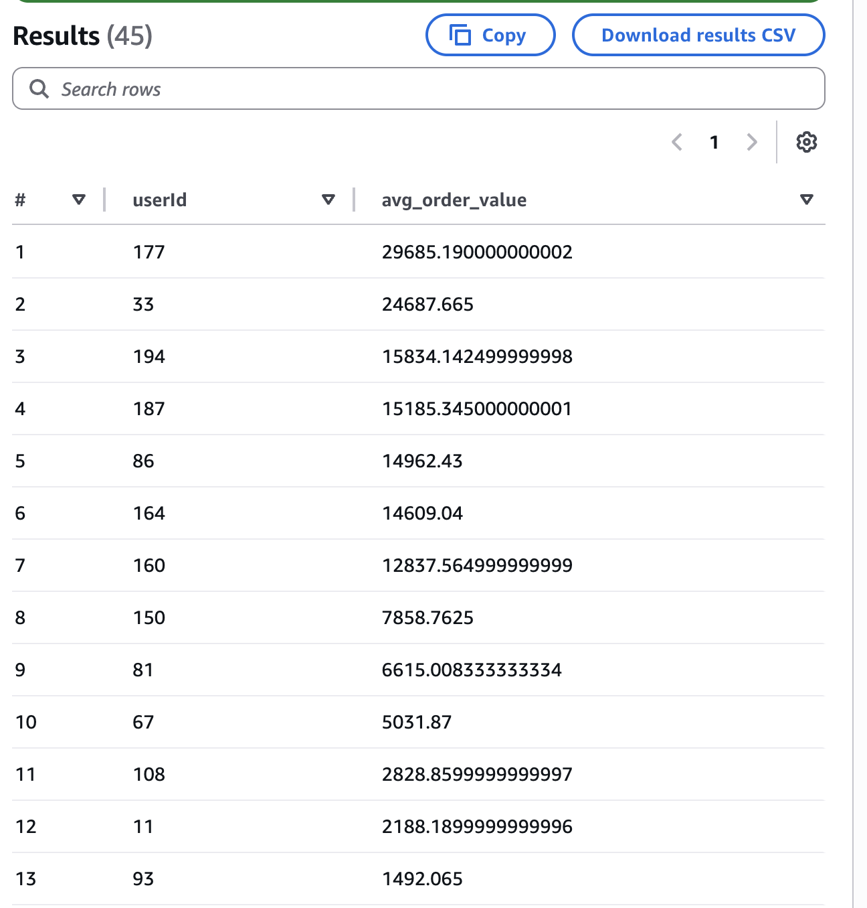
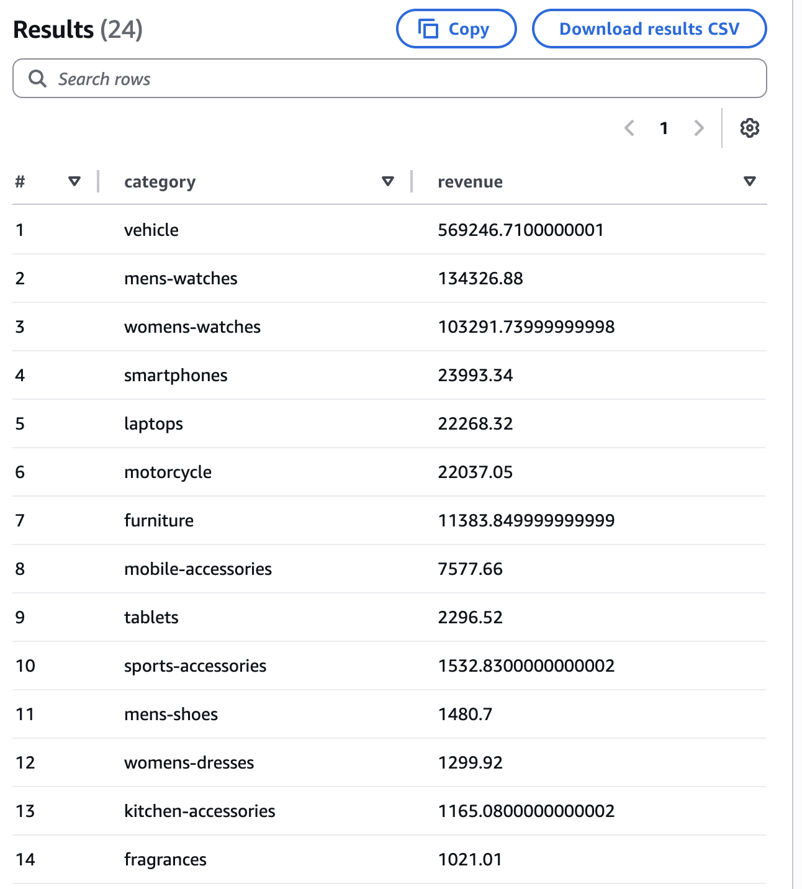

# Implementation

## Data Ingestion

I created an Amazon S3 bucket called `sl-my-project-raw-data` to serve as the landing zone for raw data before transformation.


I then uploaded the cart data from the GitHub dummyjson repository with a date partition. In production, this process would run daily and be automated using an AWS Lambda function.







For the product and user data, I used the same data source but implemented an AWS Lambda function to upload the data to the same bucket with appropriate folder structures and partitions. This Lambda function would be triggered weekly using an Amazon EventBridge cron rule. Due to restricted IAM permissions in the lab environment, I was unable to configure the trigger.

```python
import json
import boto3
import urllib3
from datetime import datetime

# Initialize clients
s3 = boto3.client('s3')
http = urllib3.PoolManager()

# Configuration
BUCKET_NAME = "sl-my-project-raw-data"

PRODUCTS_API_URL = "https://raw.githubusercontent.com/Ovi/DummyJSON/master/database/products.json"
USERS_API_URL = "https://raw.githubusercontent.com/Ovi/DummyJSON/master/database/users.json"


def fetch_api_data(url):
    response = http.request("GET", url)
    if response.status != 200:
        raise Exception(f"API call failed: {url}, Status: {response.status}")
    return json.loads(response.data.decode("utf-8"))


def upload_to_s3(data, table_name, current_date):
    s3_key = f"{table_name}/date={current_date}/data.json"

    s3.put_object(
        Bucket=BUCKET_NAME,
        Key=s3_key,
        Body=json.dumps(data),
        ContentType="application/json"
    )

    return s3_key


def lambda_handler(event, context):
    try:
        current_date = datetime.now().strftime("%Y-%m-%d")

        # Fetch data
        products_data = fetch_api_data(PRODUCTS_API_URL)
        users_data = fetch_api_data(USERS_API_URL)

        # Upload to S3
        upload_to_s3(products_data, "products", current_date)
        upload_to_s3(users_data, "users", current_date)

        return {
            "statusCode": 200,
            "body": "Products and users data uploaded successfully"
        }

    except Exception as e:
        return {
            "statusCode": 500,
            "body": str(e)
        }

```


## Data Transformation

I used AWS Glue to create metadata for the three datasets. I created a new database called `raw-data-db` and used a Crawler to populate the tables.







The Crawler ran successfully, creating three tables in the database.



We can examine the schema of each table. Below is an example showing the carts schema.


However, JSON format is not optimal for writing queries. I used an ETL job to convert the data to Parquet format, which is a columnar storage file format optimized for big data processing.

In the ETL job, I defined a new folder called `cleansed` and saved the transformed data into each respective folder. For cart data, I transformed it into order items format, which is more generally applicable.

```python
import sys
from awsglue.transforms import *
from awsglue.utils import getResolvedOptions
from pyspark.context import SparkContext
from awsglue.context import GlueContext
from awsglue.job import Job
from pyspark.sql.functions import explode, col, current_date

## @params: [JOB_NAME]
args = getResolvedOptions(sys.argv, ['JOB_NAME'])

sc = SparkContext()
glueContext = GlueContext(sc)
spark = glueContext.spark_session
job = Job(glueContext)
job.init(args['JOB_NAME'], args)

raw_products_path = "s3://sl-my-project-raw-data/raw/products/"
raw_users_path = "s3://sl-my-project-raw-data/raw/users/"
raw_carts_path = "s3://sl-my-project-raw-data/raw/carts/"

cleansed_products_path = "s3://sl-my-project-raw-data/cleansed/products/"
cleansed_users_path = "s3://sl-my-project-raw-data/cleansed/users/"
cleansed_order_items_path = "s3://sl-my-project-raw-data/cleansed/order_items/"

products_df = spark.read.option("multiline", "true").json(raw_products_path)
users_df = spark.read.option("multiline", "true").json(raw_users_path)

products_df = products_df.withColumn("date", current_date())
users_df = users_df.withColumn("date", current_date())

products_df.coalesce(1).write.mode("overwrite").partitionBy("date").parquet(cleansed_products_path)
users_df.coalesce(1).write.mode("overwrite").partitionBy("date").parquet(cleansed_users_path)

print("Products and Users JSON converted to Parquet successfully!")

carts_df = spark.read.option("multiline", "true").json(raw_carts_path)


order_items_df = carts_df.select(
    col("id").alias("orderId"),
    col("userId"),
    explode(col("products")).alias("product")
)


order_items_df = order_items_df.select(
    "orderId",
    "userId",
    col("product.id").alias("productId"),
    col("product.title").alias("title"),
    col("product.price").alias("price"),
    col("product.quantity").alias("quantity"),
    col("product.total").alias("total"),
    col("product.discountPercentage").alias("discountPercentage"),
    col("product.discountedTotal").alias("discountedTotal"),
    col("product.thumbnail").alias("thumbnail")
)


order_items_df = order_items_df.withColumn("date", current_date())


order_items_df.coalesce(1).write.mode("overwrite").partitionBy("date").parquet(cleansed_order_items_path)

print("Carts flattened into Order Items successfully!")

# ==========================
job.commit()


```


I created a new database called `cleansed-data-db` to separate raw and transformed data. All three tables are visible in this database.



The schemas for all three tables are available.


## Analytics and Reporting

### Average Order Value

```sql
SELECT userId, AVG(discountedTotal) AS avg_order_value
FROM order_items
GROUP BY userId
ORDER BY avg_order_value DESC;
```



The average order value metric reveals spending patterns per user. Users such as User 177 and User 33 show significantly higher spending compared to others. This distribution indicates that a small segment of users places high-value orders, which disproportionately influences the overall average.

### Revenue by Category

```sql
SELECT p.category, SUM(o.discountedTotal) AS revenue
FROM order_items o
JOIN products p ON o.productId = p.id
GROUP BY p.category
ORDER BY revenue DESC;
```



Revenue by category analysis shows the income generated by each product category. Higher-revenue categories represent either popular items or higher-priced products. This insight helps identify which product types drive business earnings and informs inventory and marketing decisions.

### Revenue by Age Group

```sql
SELECT 
    CASE 
        WHEN u.age < 25 THEN 'Under 25' 
        WHEN u.age BETWEEN 25 AND 34 THEN '25-34' 
        WHEN u.age BETWEEN 35 AND 44 THEN '35-44' 
        ELSE '45+' 
    END AS age_group,
    SUM(o.discountedTotal) AS revenue
FROM order_items o
JOIN users u ON o.userId = u.id
GROUP BY 
    CASE 
        WHEN u.age < 25 THEN 'Under 25' 
        WHEN u.age BETWEEN 25 AND 34 THEN '25-34' 
        WHEN u.age BETWEEN 35 AND 44 THEN '35-44' 
        ELSE '45+' 
    END
ORDER BY revenue DESC;
```


Revenue by age group analysis identifies which demographic segments contribute most to total revenue. Users aged 25-34 generate the highest revenue, followed by those aged 35-44. Users aged 45 and above contribute less, while those under 25 represent the smallest segment. This pattern suggests that the primary revenue source comes from adults in the 25-34 age range.

To gather more insights I would use QuickSight to make dashboards, but in my Lab environment I do not have permission to do that.
